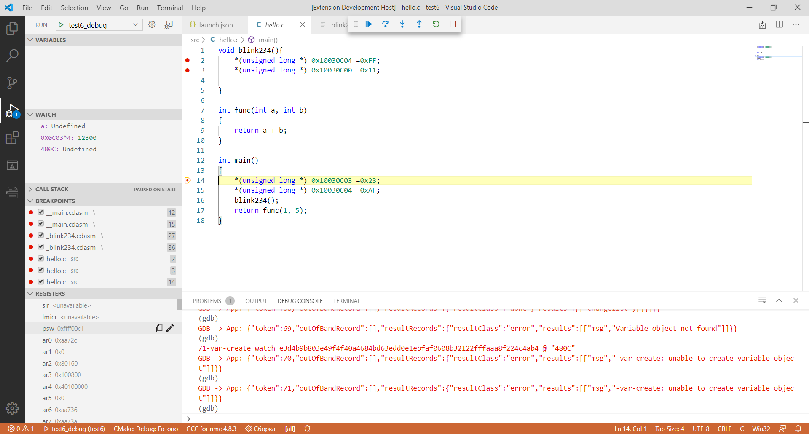

# Module Debug

Данное расширение предназначено для работы с микросхемами МС121.01.

В рамках расширения реализованы следующие функции:

* Подключение и использование NMC-GDB; 
   В файле lounch.json необходимо указать параметры:      
      "gdbTarget": "COM5", // адрес устройства COMN (/dev/ttySN), где N - номер COM порта
      "gdbpath": "nmc-gdb.exe",
      "toolchainPrefix": "nmc",
      "servertype": "external"

   Для сборки программы используется CMake. Для начала работы необходимо создать конфигурацию Ctrl+Shift+P -> CMake: Edit User-local Cmake Kits, указав необходимые компиляторы, например:
      {
       "name": "GCC for nmc 4.8.3",
       "compilers": {
         "C": "С:\\NMC-SDK\\bin\\nmc-gcc.exe",
         "CXX": "С:\\NMC-SDK\\bin\\nmc-g++.exe"
      }
   Далее необходимо выбрать созданную конфигурацию для сборки проекта Ctrl+Shift+P -> Cmake: Select a Kit.

* Функция отладки программ, написанных для поддерживаемых микросхем на языках С и С++;
* Функция просмотра кода дизассемблера синхронно с исполняемым файлом (необходимо открыть вкладку "Disassembly Explorer"  на боковой панеле);
* Функция просмотра кода дизассемблера любой указанной функции ( Ctrl+Shift+P -> Module-Debug: View Disassembly  ("function_name"));
* Функция просмотра и изменения регистров:
   * Для копирования значения - кнопка  напротив регистра во вкладке "Registers" на панеле отладки;
   * Для изменения значения - кнопка  напротив регистра во вкладке "Registers" на панеле отладки;
* Функция просмотра и изменения памяти (Ctrl+Shift+P -> Module-Debug: View Memory -> начальный_адрес -> длинна);

